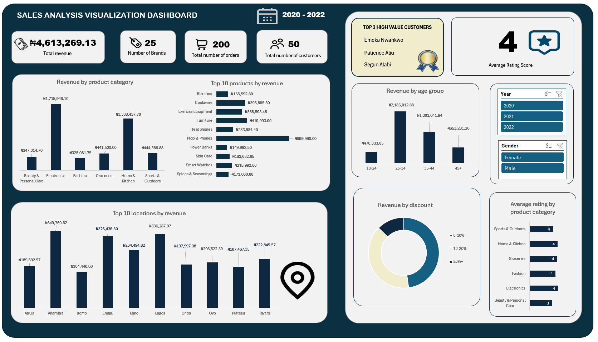

# Sales Project Analysis 2020-2022

## Overview
This repository contains a comprehensive analysis of a Nigerian e-commerce Sales dataset from 2020-2022, covering 200 transactions, 50 customers, and 25 products across 6 categories. The project integrates, cleans, and analyzes data to uncover insights on revenue, customer segments, product performance, and feedback. Built in Microsoft Excel, it demonstrates data merging, pivot dashboards, exploratory data analysis (EDA), and visualization skills, ideal for an e-commerce or data analysis portfolio.

## Project Description
The dataset includes customer demographics, product details, transactions (with discounts), and feedback (ratings/reviews). Key tasks include:
- **Data Cleaning**: Merged sheets via VLOOKUP, derived age groups/discount categories, converted dates to years.
- **Analysis**: Aggregated metrics: total revenue (₦4,613,269.13), average rating (4.035), category breakdowns (Electronics: ₦1,715,948.1), high-value customers (e.g., Patience Aliu: ₦197,997.38).
- **Visualizations**: Bar charts (revenue by category), pie charts (ratings by category), column charts (revenue by location), and line charts (yearly trends) using Excel’s pivot charts.
- **Insights**: Electronics dominate revenue; younger customers (25-34) and urban areas (Lagos) drive sales; high ratings but quality issues noted.

## Project Screenshot

## Key Findings
- **Revenue**: Total ₦4,613,269.13 from 200 orders; Electronics (₦1,715,948.1) and Home & Kitchen (₦1,087,181.1) lead.
- **Categories**: 6 categories, 25 brands/products; avg. rating 4.035, highest in Home & Kitchen (4.26).
- **Customers**: 50 total; high-value: Patience Aliu (₦197,997.38); 25-34 age group dominant.
- **Locations**: Anambra (₦349,760.62), Lagos (₦336,287.07); urban focus.
- **Trends**: Revenue growth to 2022; discounts mostly 0-10%; feedback highlights quality/delivery concerns.

## Tools and Skills
- **Tools**: Microsoft Excel (merging, pivots, charting).
- **Skills**: Data integration, EDA, visualization, business insights.
